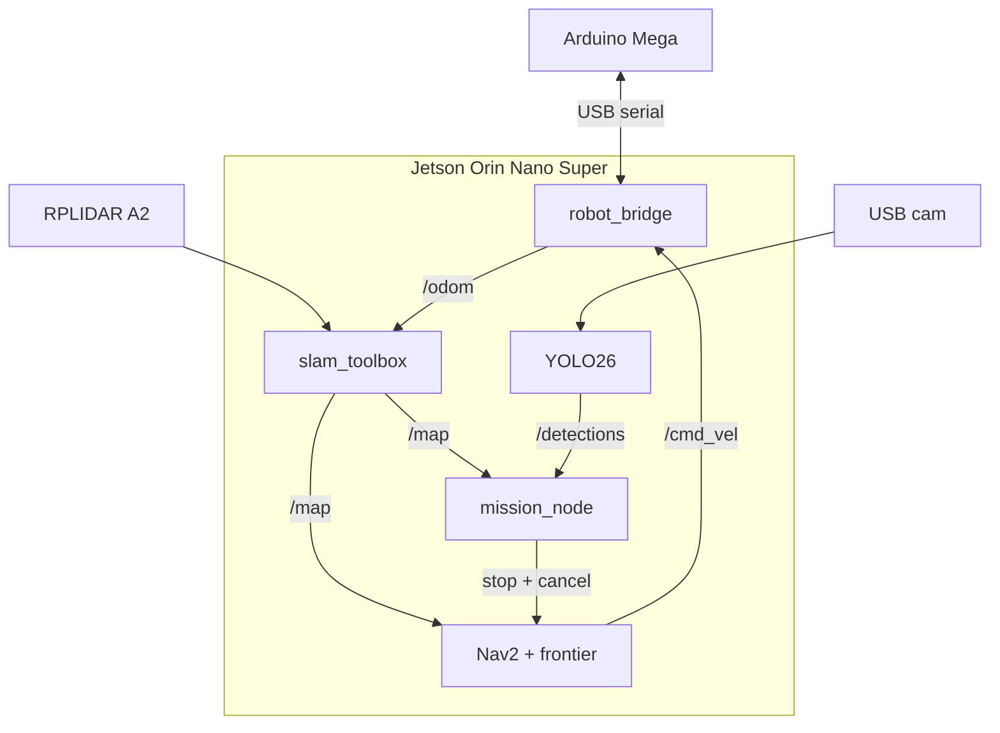

<div align="center">

# GridMark

**Map · Explore · Detect · Mark**

Autonomous indoor SLAM robot - Jetson Orin Nano Super · Arduino Mega 2560

[](LICENSE)
[](https://github.com/LucasZhang3/SLAM/commits/main)
[](https://github.com/LucasZhang3/SLAM)
[](https://github.com/LucasZhang3/SLAM)

</div>

## About

**GridMark** is a differential-drive indoor robot that builds a LiDAR occupancy map, explores unknown space with Nav2, detects a configured target with YOLO26 (TensorRT on Orin), and stops to mark the target's map-frame location. The stack runs on an NVIDIA Jetson Orin Nano Super with an Arduino Mega 2560 handling motors and encoders over USB serial.

This repository is the complete project: Mega firmware, ROS 2 Jazzy packages, trained detector weights, wiring schematics, operating captures, and field validation records.

### Gallery

<p align="center">
  
  <br />
  <em>GridMark on the lab track - multi-deck chassis, RPLIDAR, and manipulator arm</em>
</p>

<p align="center">
  
  <br />
  <em>Field arena overview - autonomous run on the taped course with LED path markers</em>
</p>

<table>
  <tr>
    <td align="center" width="50%">
      
      <br />
      <em>Top-down deck - chassis plates and open gripper</em>
    </td>
    <td align="center" width="50%">
      
      <br />
      <em>Sensor deck - LiDAR puck and arm mount</em>
    </td>
  </tr>
  <tr>
    <td align="center" width="50%">
      
      <br />
      <em>Close-up - Dynamixel actuators and onboard PCB</em>
    </td>
    <td align="center" width="50%">
      
      <br />
      <em>Gripper close-up during track testing</em>
    </td>
  </tr>
</table>

<p align="center">
  
  <br />
  <em>Operating capture - navigating the LED-lined course</em>
</p>

<p align="center">
  
  <br />
  <em>Curve run - chassis and arm lit on the black-tape path</em>
</p>

<p align="center">
  
  <br />
  <em>Hardware detail - LiDAR, arm, and battery pack on the layered deck</em>
</p>

<p align="center">
  
  <br />
  <em>Online SLAM occupancy map in RViz with live LaserScan</em>
</p>

<p align="center">
  
  <br />
  <em>3D RViz view of the occupancy map during mapping</em>
</p>

<p align="center">
  
  <br />
  <em>Mission map with the confirmed target marked in the map frame</em>
</p>

More photos and schematics: [docs/images/README.md](docs/images/README.md)

---

## Table of contents

- [About](#about)
- [Core features](#core-features)
- [Design philosophy](#design-philosophy)
- [High-level architecture](#high-level-architecture)
- [Technology stack](#technology-stack)
- [Topic and TF contract](#topic-and-tf-contract)
- [Project structure](#project-structure)
- [Installation](#installation)
- [Configuration](#configuration)
- [Quick start](#quick-start)
- [Examples](#examples)
- [Execution flow](#execution-flow)
- [Module overview](#module-overview)
- [Development workflow](#development-workflow)
- [Testing and verification](#testing-and-verification)
- [Build process](#build-process)
- [Deployment](#deployment)
- [Security considerations](#security-considerations)
- [Performance considerations](#performance-considerations)
- [Troubleshooting](#troubleshooting)
- [Documentation index](#documentation-index)
- [Roadmap](#roadmap)
- [Field checklist](#field-checklist)
- [Contributing](#contributing)
- [License](#license)

---

## Core features

| Feature | Implementation |
| --- | --- |
| Side-based differential drive | Dual BTS7960, signed PWM serial commands |
| Wheel odometry | Quadrature ISRs → tick stream → `/odom` + TF |
| Online 2D SLAM | `slam_toolbox` async → `/map`, `map`→`odom` |
| Autonomous exploration | Frontier clustering → Nav2 `NavigateToPose` |
| Object detection | YOLO26-nano fine-tuned weights → `/detections` |
| Mission completion | N-hit confirm → stop, cancel Nav2, annotate PNG |
| Ordered bringup | Topic gates for `/odom`, `/scan`, `/map` |

## Design philosophy

1. **Isolate motor power from compute power** - stall current must not brown out the Jetson.
2. **Keep the MCU loop tight** - float-heavy odometry integration and ML stay on the Jetson.
3. **One contract** - all packages share the same topics and frames ([docs/api.md](docs/api.md)).
4. **Calibrated geometry** - encoder ticks, wheel radius, track width, and sensor TFs measured on the chassis.
5. **Fail safe** - 500 ms serial command timeout stops motors if the Jetson link drops.

## High-level architecture



Deep dive: [docs/architecture.md](docs/architecture.md) · [docs/system-overview.md](docs/system-overview.md)

## Technology stack

| Layer | Choice |
| --- | --- |
| Compute | Jetson Orin Nano Super, JetPack 6.x, Ubuntu 22.04 |
| MCU | Arduino Mega 2560 |
| Middleware | ROS 2 Jazzy Jalisco |
| SLAM | slam_toolbox (online async) |
| Navigation | Nav2 + custom frontier explorer |
| Perception | Ultralytics YOLO26-nano → ONNX / TensorRT |
| LiDAR | RPLIDAR A2 (`rplidar_ros`) |
| Drive | BTS7960 ×2, 4WD + encoders |

## Topic and TF contract

| Topic | Type |
| --- | --- |
| `/scan` | `sensor_msgs/LaserScan` |
| `/odom` | `nav_msgs/Odometry` |
| `/cmd_vel` | `geometry_msgs/Twist` |
| `/map` | `nav_msgs/OccupancyGrid` |
| `/image_raw` | `sensor_msgs/Image` |
| `/detections` | `vision_msgs/Detection2DArray` |
| `/exploration_complete` | `std_msgs/Bool` |

**TF:** `map` → `odom` → `base_link` → `{lidar_link, camera_link}`

Full semantics: [docs/api.md](docs/api.md)

## Project structure

```text
GridMark/
├── LICENSE
├── README.md
├── docs/
│   ├── images/robot/          top-down chassis photo
│   ├── images/features/       SLAM map, YOLO, operating captures
│   ├── images/schematics/     wiring schematics
│   └── ...
└── robot_ws/src/
    ├── robot_bringup/
    ├── robot_firmware/
    ├── robot_bridge/
    ├── robot_slam/
    ├── robot_navigation/
    ├── robot_perception/      includes trained YOLO26 weights
    └── robot_mission/
```

## Installation

See **[docs/installation.md](docs/installation.md)**.

```bash
git clone https://github.com/LucasZhang3/SLAM.git
cd SLAM/robot_ws
source /opt/ros/jazzy/setup.bash
rosdep install --from-paths src -y --ignore-src
colcon build --symlink-install
source install/setup.bash
```

## Configuration

Parameters are tabulated in **[docs/configuration.md](docs/configuration.md)**.

Firmware geometry constants match `robot_bridge/config/odom_calibration.yaml`.

## Quick start

```bash
ros2 launch robot_bringup full_system.launch.py
```

CLI cookbook: [docs/cli.md](docs/cli.md)

## Examples

**Serial motor check (115200):**

```text
L80 R80
L0 R0
```

**Perception with shipped weights:**

```bash
ros2 launch robot_perception perception.launch.py
```

## Execution flow

1. Bridge streams PWM; Mega returns `ODOM` deltas.
2. Bridge publishes `/odom` + TF.
3. LiDAR publishes `/scan`; SLAM builds `/map`.
4. Frontier explorer sends Nav2 goals.
5. YOLO publishes `/detections`.
6. Mission confirms target → zero `/cmd_vel`, cancel Nav2, write PNG.

## Module overview

| Module | Doc |
