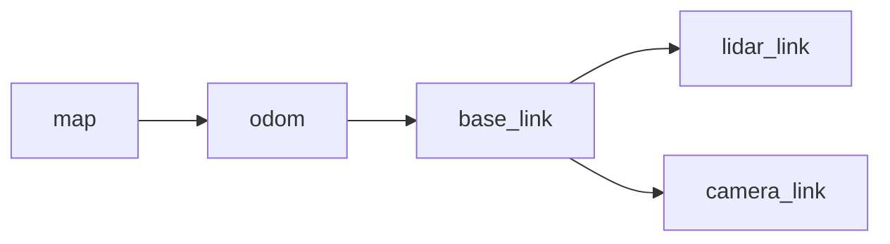

# Architecture

This document describes how the GridMark software and hardware layers fit together: components, data flow, control flow, TF tree, startup/shutdown, and design patterns.

## Component map

| Component | Location | Responsibility |
| --- | --- | --- |
| Firmware | `robot_ws/src/robot_firmware/robot_firmware.ino` | PWM drive, encoder ISRs, ODOM tick lines, command timeout |
| Serial bridge | `robot_bridge` / `serial_bridge_node` | Twist→PWM, ticks→`/odom`+TF |
| LiDAR driver | External `rplidar_ros` | Publishes `/scan` |
| SLAM | `robot_slam` + `slam_toolbox` | `/map`, `map`→`odom`, lidar static TF |
| Navigation | `robot_navigation` + Nav2 | Costmaps, planner, controller |
| Frontier explorer | `frontier_explorer_node` | Frontiers → `NavigateToPose` |
| Perception | `robot_perception` | `/image_raw` → `/detections` |
| Mission | `robot_mission` | Confirm target, stop, annotate map |
| Bringup | `robot_bringup` | Ordered launch with topic gates |

## Directory organization

```text
robot_ws/
  src/
    robot_bringup/ ament_cmake - full_system.launch.py
    robot_firmware/ Arduino sketch (not a ROS package)
    robot_bridge/ ament_python - serial_bridge_node
    robot_slam/ ament_cmake - slam params + launch
    robot_navigation/ ament_python - Nav2 params + frontier node
    robot_perception/ ament_python - YOLO + usb_cam launch
    robot_mission/ ament_python - mission_node
docs/ This documentation suite + hardware/
```

## TF tree



| Transform | Publisher | Notes |
| --- | --- | --- |
| `map` → `odom` | `slam_toolbox` | Corrects odom drift while mapping |
| `odom` → `base_link` | `serial_bridge_node` | Integrated from encoder ticks |
| `base_link` → `lidar_link` | `static_transform_publisher` in `slam.launch.py` | Example defaults 0.10, 0.00, 0.15 m |
| `base_link` → `camera_link` | `static_transform_publisher` in `full_system.launch.py` | Example defaults 0.12, 0.00, 0.20 m |

