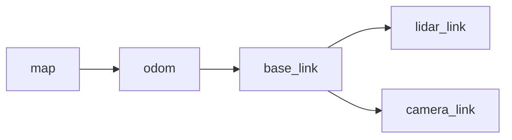
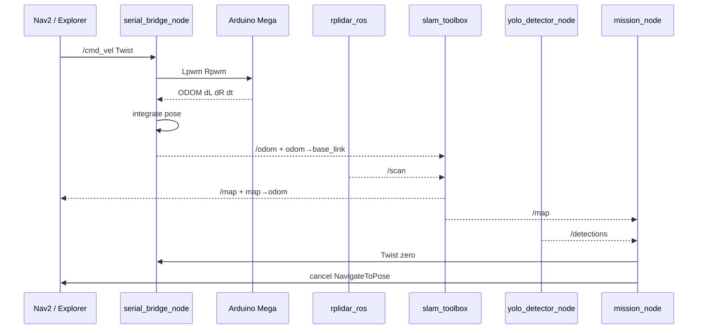
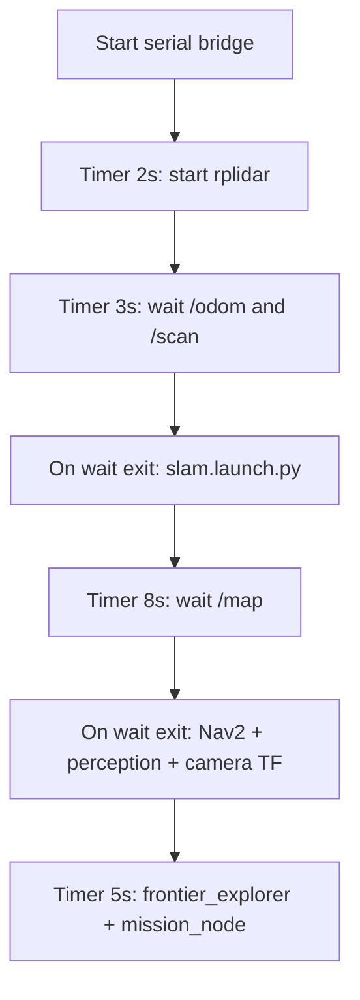
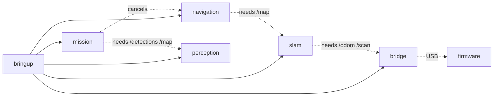

# Architecture

This document describes how the GridMark software and hardware layers fit together: components, data flow, control flow, TF tree, startup/shutdown, and design patterns.

## Component map

| Component | Location | Responsibility |
| --- | --- | --- |
| Firmware | `robot_ws/src/robot_firmware/robot_firmware.ino` | PWM drive, encoder ISRs, ODOM tick lines, command timeout |
| Serial bridge | `robot_bridge` / `serial_bridge_node` | Twist→PWM, ticks→`/odom`+TF |
| LiDAR driver | External `rplidar_ros` | Publishes `/scan` |
| SLAM | `robot_slam` + `slam_toolbox` | `/map`, `map`→`odom`, lidar static TF |
| Navigation | `robot_navigation` + Nav2 | Costmaps, planner, controller |
| Frontier explorer | `frontier_explorer_node` | Frontiers → `NavigateToPose` |
| Perception | `robot_perception` | `/image_raw` → `/detections` |
| Mission | `robot_mission` | Confirm target, stop, annotate map |
| Bringup | `robot_bringup` | Ordered launch with topic gates |

## Directory organization

```text
robot_ws/
  src/
    robot_bringup/ ament_cmake - full_system.launch.py
    robot_firmware/ Arduino sketch (not a ROS package)
    robot_bridge/ ament_python - serial_bridge_node
    robot_slam/ ament_cmake - slam params + launch
    robot_navigation/ ament_python - Nav2 params + frontier node
    robot_perception/ ament_python - YOLO + usb_cam launch
    robot_mission/ ament_python - mission_node
docs/ This documentation suite + hardware/
```

## TF tree



| Transform | Publisher | Notes |
| --- | --- | --- |
| `map` → `odom` | `slam_toolbox` | Corrects odom drift while mapping |
| `odom` → `base_link` | `serial_bridge_node` | Integrated from encoder ticks |
| `base_link` → `lidar_link` | `static_transform_publisher` in `slam.launch.py` | Example defaults 0.10, 0.00, 0.15 m |
| `base_link` → `camera_link` | `static_transform_publisher` in `full_system.launch.py` | Example defaults 0.12, 0.00, 0.20 m |

TF translations above are calibrated values. Measure mounts on the real chassis.

## Data flow



## Control flow (mission-critical path)

1. Explorer (or teleop) publishes `/cmd_vel`. 
2. Bridge converts to side PWM and writes serial at 20 Hz. 
3. Mega applies PWM; encoders update tick counts on CHANGE ISRs. 
4. Every 20 ms Mega emits tick deltas; bridge integrates mid-point odometry. 
5. SLAM consumes `/scan` + odom TF; publishes `/map`. 
6. Costmaps inflate obstacles; planner/controller follow goals. 
7. YOLO emits detections; mission requires N consecutive hits. 
8. On confirm: zero velocity, cancel Nav2 goals, write annotated PNG.

## Startup sequence (`full_system.launch.py`)



**Why gates exist:** Starting `slam_toolbox` before `/scan` or odom TF causes dropped scans and empty maps. Starting Nav2 before `/map` leaves the static layer empty and planning fails.

**Assumption:** `bash`, `ros2 topic list`, and `grep` are available on the Jetson (used by wait scripts).

## Shutdown sequence

| Step | Behavior in this codebase |
| --- | --- |
| Ctrl+C / launch teardown | ROS nodes receive shutdown; bridge `destroy_node` writes `L0 R0` then closes serial |
| Abrupt USB unplug | Mega command timeout (500 ms) zeroes motors |
| Mission confirm | Publishes zero Twist and requests Nav2 cancel; does not power down hardware |

## Design patterns

| Pattern | Where | Why |
| --- | --- | --- |
| Bridge / adapter | `serial_bridge_node` | Isolates ROS types from ASCII serial |
| Rate limiting | YOLO timer; cmd_vel timer | Protects Orin Nano and Mega loop |
| Action client | Frontier + mission cancel | Nav2 goal interface |
| Static TF | Sensor mounts | Keeps URDF optional for this project |
| Parameter YAML | Bridge, SLAM, Nav2, usb_cam | Recalibrate without recompiling |
| Lifecycle (external) | `slam_toolbox` via its launch | Configure/activate online async node |

## Dependencies between packages



Solid arrows: launch/package depends. Dotted: runtime topic/TF/serial coupling.

## Internal abstractions

- **Side PWM** - Left/right signed integers −255…255, not individual motor IDs (paralleled motors per side). 
- **Tick deltas** - Firmware sends Δticks per interval, not cumulative counts (reduces serial bandwidth; bridge keeps integrators). 
- **Frontier cluster** - Connected free cells adjacent to unknown; goal = centroid. 
- **No-depth ray** - Mission intersects camera ray with `z = target_height_m` in map, else `assumed_range_m`.

## Edge cases & failure modes (architectural)

| Failure | Effect | Mitigation in design |
| --- | --- | --- |
| Serial drop | Robot may keep last PWM | 500 ms firmware timeout |
| Wrong TPR/radius | Map smear | Phase 2 calibration docs |
| LiDAR on unpowered hub port | `/scan` drops | Powered hub requirement |
| YOLO too fast | SLAM/Nav2 lag | Default 8 Hz inference |
| Missing `.engine` | Detector no-ops | Log error; other stack can still run |
| TF mount wrong | Scan/map misaligned; bad mission XY | Launch args + wiring measurement |

## Related

- [API](api.md) - exact message fields and serial grammar 
- [Workflows/bringup](workflows/bringup.md) - operator view of startup 
- [Packages](packages/README.md) 
