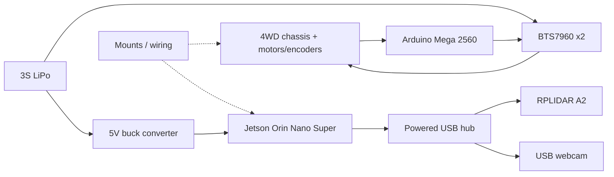

# Bill of Materials

Bill of materials for the robot we built. Confirm current vendor SKUs if reordering.

Approximate prices below are order-of-magnitude USD figures based on common retail listings for these product classes at the time this document was drafted. Prices reflect the SKUs we ordered; re-check vendors for current quotes.

| Component class | Example product | Qty | Approx. price (USD) | Notes |
| --- | --- | --- | --- | --- |
| 4WD chassis kit with DC gear motors + encoders | Generic 4WD smart robot car chassis (acrylic/aluminum plate, 4× DC gear motors, 4× wheels, quadrature encoders on motor shafts) | 1 | 35-60 | Prefer kits that expose encoder A/B (and optionally Z) wires per motor; left/right motors are paralleled electrically per side for drive, but encoders are typically read from one motor per side (see encoder wiring). |
| Low-level controller | Arduino Mega 2560 (official or compatible) | 1 | 15-45 | Chosen for six external interrupt-capable pins (2, 3, 18, 19, 20, 21). USB-B for programming and optional bus power from Jetson. |
| High-level compute | NVIDIA Jetson Orin Nano Super Developer Kit | 1 | 250-500 | JetPack 6.x / Ubuntu 22.04 target. Power from regulated 5 V barrel/DC input via buck converter (see power wiring). |
| 2D LiDAR | Slamtec RPLIDAR A2 (with USB adapter board) | 1 | 100-200 | Driven by `rplidar_ros`; connect through powered USB hub, not a Jetson root port. |
| Motor driver | BTS7960 dual H-bridge module | 2 | 10-20 each | One module per side (left pair / right pair). Motors on each side wired in parallel to that module’s M+/M−. |
| RGB camera | UVC USB webcam (720p or 1080p) | 1 | 15-40 | Used with `usb_cam` → `/image_raw`; YOLO26 TensorRT inference on Jetson. Mount for known `camera_link` TF. |
| Battery pack | 3S LiPo 11.1 V (capacity sized for motor current draw) | 1 | 25-60 | many small 4WD kits draw amp-level continuous current and tens of amps at stall; a common starting class is ~2200-5000 mAh 3S with a discharge rating ≥ motor stall sum. Measure stall current per motor with a clamp/inline meter before final capacity selection. Use a LiPo-safe charger and balance lead. |
| Regulated compute supply | DC-DC buck converter, adjustable, ≥5 A continuous preferred | 1 | 8-25 | Steps 3S pack voltage down to a clean regulated **5 V** for the Jetson DC/barrel input. Isolate motor and compute rails. |
| USB expansion | Powered USB hub (externally powered) | 1 | 15-35 | Hosts RPLIDAR A2 and USB webcam; reduces bandwidth/power contention on Jetson USB ports. |
| Mounting hardware | M2/M3 standoffs, screws, nuts, camera/LiDAR brackets | 1 set | 10-25 | Needed for rigid `base_link` → `lidar_link` / `camera_link` offsets. |
| Wiring / interconnect | JST connectors, Dupont jumper wires, heat shrink tubing, silicone wire (motor gauge) | 1 kit | 10-30 | Use heavier gauge for battery→BTS7960 and motor leads; signal wire for Mega→driver PWM/EN and encoder lines. |

## Sizing notes (builder actions)

1. **Motor current:** stall-test one motor at pack voltage (briefly, with current limit / fuse) and multiply by motors paralleled per side; size BTS7960 supply wiring and LiPo C-rating accordingly.
2. **Buck converter:** Jetson Orin Nano Super Developer Kit can draw several amps under CUDA/TensorRT load - select a buck rated with margin above the kit’s documented DC-input current, then verify with a meter under SLAM + YOLO load.
3. **Fusing:** place an appropriately rated fuse or circuit breaker on the battery positive lead before the power switch split.

## Out of scope for this BOM

Safety glasses, LiPo fire bag/charger, soldering tools, and lab supplies are assumed available and are not line items above.
