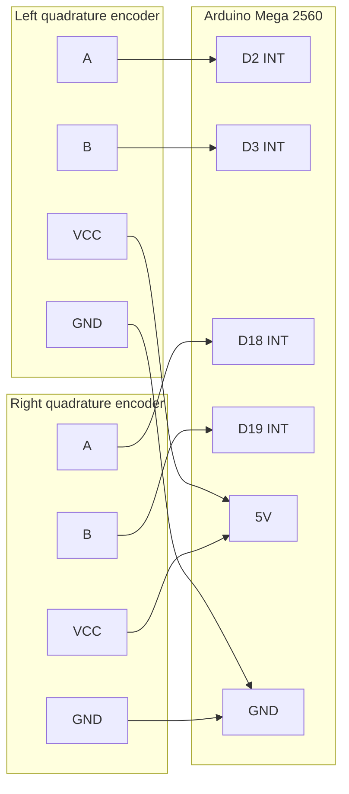

# Encoder Wiring (Quadrature → Arduino Mega Interrupts)

Each driven side uses a quadrature (A/B) encoder for wheel odometry. Channels are wired to the Mega’s **external interrupt-capable** pins so every rising/falling edge can be captured even when the main `loop()` is busy with serial I/O or motor updates.

## Schematic

## Why interrupt pins are required

Quadrature decoding advances (or retreats) a tick count on **every edge** of A and/or B, depending on the decode mode (×1 / ×2 / ×4). At typical gear-motor speeds, edge rates are high enough that polling inside `loop()` will miss edges whenever the CPU is blocked on other work (USB serial to the Jetson, PWM updates, etc.). Missed edges become odometry slip and corrupt `/odom`.

The Arduino Mega 2560 exposes external interrupts on pins **2, 3, 18, 19, 20, 21**. This project uses four of them for the two encoders (A/B × left/right). Pins 20/21 remain free (also used for I2C SDA/SCL if a future sensor needs the bus).

## Channel assignment

| Encoder | Channel | Arduino Mega pin | Interrupt capability |
| --- | --- | --- | --- |
| Left | A | **D2** | External interrupt |
| Left | B | **D3** | External interrupt |
| Right | A | **D18** | External interrupt |
| Right | B | **D19** | External interrupt |

## Power and ground

Encoder modules on these chassis kits are typically **5 V** logic devices. Power them from the Mega’s regulated 5 V (or a shared clean 5 V logic rail referenced to Mega GND) - **not** from the raw 3S LiPo.

| Supply | Connection |
| --- | --- |
| Encoder VCC (left and right) | Arduino Mega **5V** |
| Encoder GND (left and right) | Arduino Mega **GND** |

Share a single solid GND between Mega, encoders, and BTS7960 **logic** grounds so A/B thresholds are valid. Motor high-current return stays on the pack/BTS7960 power harness (see power wiring).

## Plain-text pin table

| Component | Pin | Connects to |
| --- | --- | --- |
| Left encoder | Channel A | Arduino Mega D2 |
| Left encoder | Channel B | Arduino Mega D3 |
| Left encoder | VCC / +5V | Arduino Mega 5V |
| Left encoder | GND | Arduino Mega GND |
| Right encoder | Channel A | Arduino Mega D18 |
| Right encoder | Channel B | Arduino Mega D19 |
| Right encoder | VCC / +5V | Arduino Mega 5V |
| Right encoder | GND | Arduino Mega GND |
| Arduino Mega | GND | Common logic ground with drivers |

If a kit exposes an index/Z channel, leave it unconnected unless firmware is extended to use it.

## Which physical encoder per side?

On a paralleled dual-motor side, both wheels should track similarly if the drivetrain is rigid. Builders typically wire **one encoder per side** (e.g. left-front and right-front) and treat that count as the side’s odometry. If both motors on a side have encoders, pick one consistently and document it on the robot; do not average unsynchronized counts unless the firmware explicitly supports it.

## Mermaid diagram

## Builder verification (how to measure ticks/rev yourself)

We measured ticks-per-revolution on the assembled drivetrain.

1. Lift the robot so wheels spin freely.
2. Mark the wheel and a fixed reference on the chassis.
3. Rotate the marked wheel exactly one revolution by hand while firmware prints encoder counts.
4. Record left and right counts separately; use those measured CPR/PPR values in the odometry model inside `robot_firmware` / `robot_bridge`.

Gearbox ratio and encoder disc resolution vary by kit SKU - always measure on the assembled robot.
