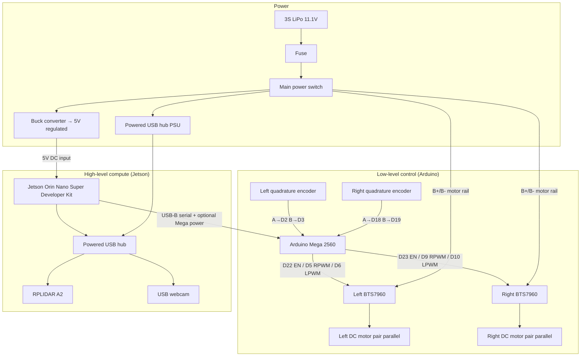

# Full System Schematic

Consolidated interconnection view for the GridMark. Prefer the
rendered schematic image below for assembly reviews; Mermaid remains available
for text diffs. For pin-level detail, use the sibling docs: [power-wiring.md](power-wiring.md), [motor-driver-wiring.md](motor-driver-wiring.md), [encoder-wiring.md](encoder-wiring.md), [lidar-and-camera-wiring.md](lidar-and-camera-wiring.md).

## Rendered schematic

## Visual reference (assembled robot)

## Consolidated Mermaid schematic

## Signal / power legend (plain text)

| From | To | What |
| --- | --- | --- |
| 3S LiPo → fuse → switch | Both BTS7960 B+/B− | Motor power |
| Switch → buck → 5 V | Jetson DC / barrel input | Isolated compute power |
| Switch / wall → hub PSU | Powered USB hub | LiDAR + camera device power |
| Jetson USB | Powered hub upstream | Sensor data |
| Hub | RPLIDAR A2 USB adapter | `/scan` path |
| Hub | USB webcam | `/image_raw` path |
| Jetson USB | Arduino Mega USB-B | Serial bridge + optional Mega 5 V |
| Mega D22/D5/D6 | Left BTS7960 | Enable + PWM |
| Mega D23/D9/D10 | Right BTS7960 | Enable + PWM |
| Left encoder A/B | Mega D2 / D3 | Quadrature IRQs |
| Right encoder A/B | Mega D18 / D19 | Quadrature IRQs |
| Left/right BTS7960 M+/M− | Left/right motor pairs | Drive |
| Mega 5V/GND | Encoder VCC/GND + driver logic VCC/GND | Logic supply / reference |

## Related ROS topic contract (software side)

Once powered and launched, the software architecture expects:

| Topic | Type | Producer |
| --- | --- | --- |
| `/scan` | `sensor_msgs/LaserScan` | `rplidar_ros` |
| `/odom` | `nav_msgs/Odometry` | `robot_bridge` (from Mega encoder stream) |
| `/cmd_vel` | `geometry_msgs/Twist` | Nav2 → `robot_bridge` → Mega → BTS7960 |
| `/image_raw` | `sensor_msgs/Image` | `usb_cam` |
| `/map` | `nav_msgs/OccupancyGrid` | `slam_toolbox` |

TF: `map` → `odom` → `base_link` → `{lidar_link, camera_link}`.
