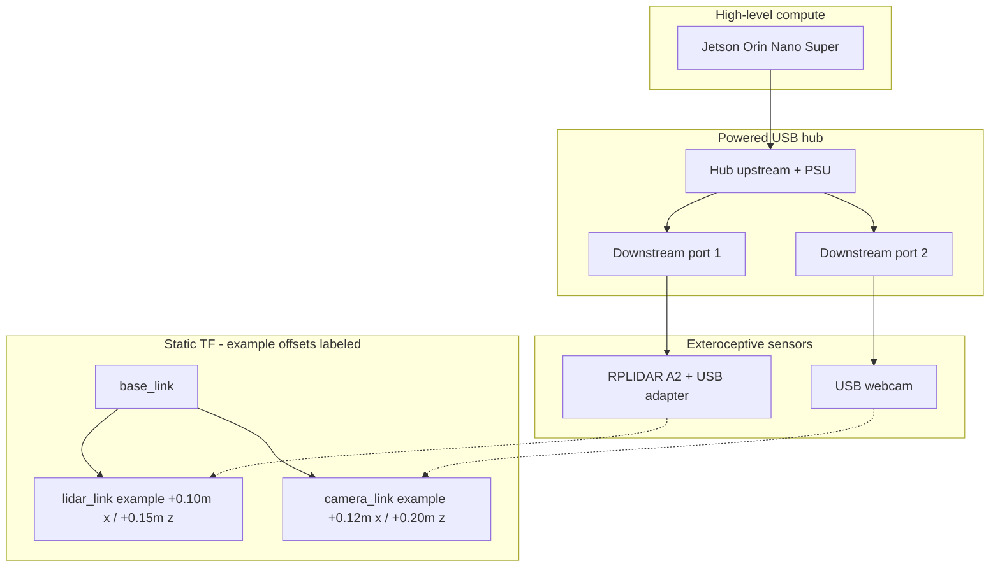

# LiDAR and Camera Wiring

RPLIDAR A2 and the USB webcam both connect to the **Jetson Orin Nano Super** through a **powered USB hub**. Do **not** plug the LiDAR (and preferably not the camera) directly into a Jetson root USB port for this project’s default configuration - shared bandwidth and port power budgeting are a common failure mode (“where people get stuck”: intermittent `/scan`, USB resets, or camera stalls when SLAM and YOLO run together).

## Schematic and mount reference


## USB topology

| Device | Connection | Host path |
| --- | --- | --- |
| Powered USB hub | Upstream cable | Jetson USB host port |
| Powered USB hub | External power supply | Hub’s own DC input (required - do not run hub bus-powered only) |
| RPLIDAR A2 | USB adapter board → USB-A cable | **Powered hub** downstream port |
| USB webcam | USB-A cable | **Powered hub** downstream port |

The hub’s upstream link carries data to the Jetson; the hub PSU supplies device current so the Jetson port is not asked to source LiDAR motor + camera power.

## Plain-text pin / connection table

| Component | Pin / port | Connects to |
| --- | --- | --- |
| RPLIDAR A2 | Interface cable | Official USB adapter board (as supplied with A2 kits) |
| RPLIDAR USB adapter | USB-A plug | Powered USB hub port 1 |
| USB webcam | USB-A plug | Powered USB hub port 2 |
| Powered USB hub | Upstream USB | Jetson Orin Nano Super USB host |
| Powered USB hub | DC power input | Hub manufacturer’s rated supply (or suitable regulated output) |
| Jetson | USB host | Hub upstream only (for these sensors) |

ROS expectations once enumerated on Linux:

- LiDAR → `rplidar_ros` → `/scan` (`sensor_msgs/LaserScan`) 
- Camera → `usb_cam` → `/image_raw` (`sensor_msgs/Image`)

## Physical mounting and static TF frames

The TF tree for this project includes:

`map` → `odom` → `base_link` → `{lidar_link, camera_link}`

Static transforms `base_link` → `lidar_link` and `base_link` → `camera_link` must match the **real** mount positions on the assembled chassis (tape measure + consistent frame convention: X forward, Y left, Z up, unless your `robot_bringup` launch states otherwise).

### Example / reference offsets (values)

The numbers below match the sensor mounts used on this chassis (also set in `robot_slam` / `robot_perception` launch). Re-measure relative to `base_link` if you relocate the LiDAR or camera.

| Transform | Example translation (m) | Example rotation (rad) | Meaning of example |
| --- | --- | --- | --- |
| `base_link` → `lidar_link` | x = **0.10**, y = **0.00**, z = **0.15** | roll = **0.0**, pitch = **0.0**, yaw = **0.0** | LiDAR ~10 cm forward, 15 cm up, no yaw offset from chassis center |
| `base_link` → `camera_link` | x = **0.12**, y = **0.00**, z = **0.20** | roll = **0.0**, pitch = **0.0**, yaw = **0.0** | Camera ~12 cm forward, 20 cm up, level (0 pitch/roll/yaw) |

These LiDAR numbers are the **exact defaults** used by `robot_slam/launch/slam.launch.py` launch arguments:

| Launch argument | Default | Maps to |
| --- | --- | --- |
| `lidar_x` | `0.10` | translation x (m) |
| `lidar_y` | `0.00` | translation y (m) |
| `lidar_z` | `0.15` | translation z (m) |
| `lidar_roll` | `0.0` | roll (rad) |
| `lidar_pitch` | `0.0` | pitch (rad) |
| `lidar_yaw` | `0.0` | yaw (rad) |

Example after measuring a different mount:

```bash
ros2 launch robot_slam slam.launch.py lidar_x:=0.11 lidar_y:=0.0 lidar_z:=0.16 lidar_yaw:=0.0
```

How a builder derives real values:

1. Define `base_link` (e.g. ground-projected chassis center, or mid-axle). 
2. Measure to the LiDAR optical / scan plane origin and to the camera optical frame (lens). 
3. Convert cm → m for `static_transform_publisher` / URDF. 
4. If the LiDAR spin motor or camera look slightly towed-in, measure yaw/pitch with a digital angle gauge - do not leave yaw at 0 if the mount is rotated.
5. Pass the measured values into `slam.launch.py` (and later the camera static TF in perception/bringup) so docs, launch, and the robot stay consistent.

## Mermaid diagram



## Mounting tips

- Keep the LiDAR scan plane above bumper height; avoid cabling in the spin volume. 
- Point the camera toward the forward driving direction if mission logic assumes detections ahead of the robot. 
- After changing mounts, update the static TF launch in `robot_bringup` / `robot_slam` and re-check that `/scan` and camera rays align with the map in RViz.
