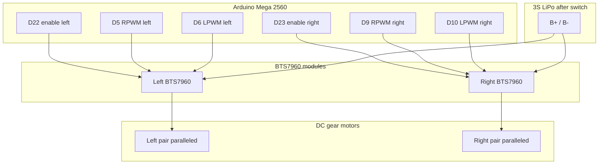

# Motor Driver Wiring (Dual BTS7960)

This chassis is 4WD: two DC gear motors on the **left** side and two on the **right**. Electrically, the two motors on each side are wired **in parallel** and driven by **one BTS7960 module** per side (two modules total).

## Schematic

## Pin assignment summary

| Role | Left BTS7960 | Right BTS7960 |
| --- | --- | --- |
| Module enable (R_EN + L_EN tied together) | Arduino Mega **D22** | Arduino Mega **D23** |
| RPWM | Arduino Mega **D5** (PWM) | Arduino Mega **D9** (PWM) |
| LPWM | Arduino Mega **D6** (PWM) | Arduino Mega **D10** (PWM) |
| Motor output | M+ / M− → left motor pair (parallel) | M+ / M− → right motor pair (parallel) |
| Battery power | B+ / B− → switched 3S LiPo rail | B+ / B− → switched 3S LiPo rail |

R_EN and L_EN on each module are jumpered together and driven from a single digital pin so firmware can enable/disable that side with one write. RPWM/LPWM are complementary PWM channels on the BTS7960 for forward/reverse drive.

## Plain-text pin table

| Component | Pin | Connects to |
| --- | --- | --- |
| Left BTS7960 | R_EN | Arduino Mega D22 (tied to L_EN) |
| Left BTS7960 | L_EN | Arduino Mega D22 (tied to R_EN) |
| Left BTS7960 | RPWM | Arduino Mega D5 |
| Left BTS7960 | LPWM | Arduino Mega D6 |
| Left BTS7960 | VCC (logic) | Arduino Mega 5V |
| Left BTS7960 | GND (logic) | Arduino Mega GND (common signal ground) |
| Left BTS7960 | B+ | Battery positive (after main power switch) |
| Left BTS7960 | B− | Battery negative / pack ground |
| Left BTS7960 | M+ | Left front motor + **and** left rear motor + (paralleled) |
| Left BTS7960 | M− | Left front motor − **and** left rear motor − (paralleled) |
| Right BTS7960 | R_EN | Arduino Mega D23 (tied to L_EN) |
| Right BTS7960 | L_EN | Arduino Mega D23 (tied to R_EN) |
| Right BTS7960 | RPWM | Arduino Mega D9 |
| Right BTS7960 | LPWM | Arduino Mega D10 |
| Right BTS7960 | VCC (logic) | Arduino Mega 5V |
| Right BTS7960 | GND (logic) | Arduino Mega GND (common signal ground) |
| Right BTS7960 | B+ | Battery positive (after main power switch) |
| Right BTS7960 | B− | Battery negative / pack ground |
| Right BTS7960 | M+ | Right front motor + **and** right rear motor + (paralleled) |
| Right BTS7960 | M− | Right front motor − **and** right rear motor − (paralleled) |
| Arduino Mega | GND | Pack ground / BTS7960 GND (signal reference only; see power wiring) |

## Parallel motor wiring (per side)

For each side, solder or screw-terminal the two motors so that:

- both motor **+** leads join at the module **M+**
- both motor **−** leads join at the module **M−**

Confirm that both motors on a side rotate the same mechanical direction when M+/M− are driven forward; reverse one motor’s lead pair if a wheel spins opposite to its sibling.

## Mermaid diagram

## Firmware notes (for `robot_firmware`)

- Assert enable pins HIGH only after PWM outputs are initialized to a safe (stopped) state.
- Never drive RPWM and LPWM both high at high duty for long periods; use one channel for forward and the other for reverse (or follow the module vendor’s recommended complementary PWM scheme).
- Keep motor power (B+/B−) on the thick battery harness; do not attempt to power motors from the Mega 5 V pin.
