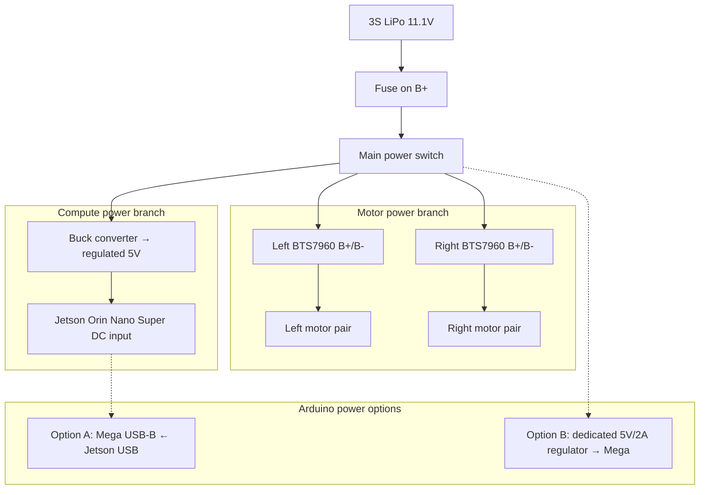

# Power Wiring

Motors and compute must not share an unprotected low-impedance rail. Gear-motor **stall** current can pull a shared 5 V/USB supply into brown-out, resetting the Jetson or Arduino mid-run. This project isolates **motor power** (raw pack → BTS7960) from **compute power** (pack → buck → regulated 5 V → Jetson).

## Schematic

## Power tree (logical)

1. **3S LiPo 11.1 V** pack 
2. → **Main power switch** (and fuse on B+) 
3. → Split: 
   - **(a) Motor branch:** switched pack voltage → both BTS7960 **B+/B−** (and thus the paralleled motor pairs) 
   - **(b) Compute branch:** switched pack voltage → **buck converter** → clean regulated **5 V** → Jetson Orin Nano Super **barrel / DC input**

Arduino Mega 2560 is powered **separately** via its **USB-B** port from a Jetson USB port (convenient for serial bridge + 5 V logic supply), **or** from a dedicated 5 V / ≥2 A regulator if you want the Mega electrically isolated from the Jetson’s USB bus.

## Reasoning

| Concern | Mitigation in this design |
| --- | --- |
| Motor stall / PWM current spikes | Heavy gauge wire + fuse; BTS7960 fed directly from pack; not from Jetson 5 V |
| Jetson brown-out under CUDA + USB devices | Dedicated buck to Jetson DC input; sensors on **powered** USB hub |
| Ground loops / logic reference | Common **signal** GND between Mega, driver logic GND, encoders; high current returns stay on pack negative |
| USB bus overload | LiDAR + camera on externally powered hub (see LiDAR/camera wiring) |

## Plain-text connection table

| Component | Pin / terminal | Connects to |
| --- | --- | --- |
| 3S LiPo | Battery + | Fuse input |
| Fuse | Output | Main power switch input |
| Main power switch | Output (switched B+) | BTS7960 B+ (left), BTS7960 B+ (right), buck converter VIN+ |
| 3S LiPo | Battery − | BTS7960 B− (both), buck converter VIN− / GND, common pack ground |
| Buck converter | VOUT+ (set to 5.0 V) | Jetson Orin Nano Super DC / barrel positive |
| Buck converter | VOUT− | Jetson DC / barrel ground |
| Jetson USB port (Host) | USB-A/C as equipped | Arduino Mega USB-B **or** powered hub upstream (hub also needs its own wall/pack-derived supply - see notes) |
| Arduino Mega | USB-B | Jetson USB host (default option) **or** dedicated 5 V regulator output |
| Dedicated 5 V regulator (optional) | VIN | Switched pack (or separate cell) |
| Dedicated 5 V regulator (optional) | VOUT 5 V / GND | Arduino Mega 5V & GND (if not using USB power) |

**Before connecting the Jetson:** adjust and measure the buck **VOUT with a multimeter** under no load, then again under load. Confirm **5.0 V** within the Developer Kit’s allowed DC-input range per the NVIDIA kit documentation.

## Capacity / current (builder measurement)

Exact amp-hours and stall amps depend on the motor SKU and terrain. A real builder should:

1. Measure free-run and stall current per motor at pack voltage. 
2. Sum paralleled motors per side for peak driver current. 
3. Size the LiPo C-rating and main fuse above that peak with margin. 
4. Measure Jetson DC input current during `slam_toolbox` + TensorRT YOLO load and confirm buck headroom.

## Mermaid diagram - full power tree

## Safety checklist

- Use a LiPo balance charger and storage voltage practices appropriate for 3S packs. 
- Do not reverse B+/B− on BTS7960 modules. 
- Verify buck polarity before plugging into the Jetson. 
- Keep motor wires twisted/short where practical; keep encoder/PWM signal wires away from motor leads.
