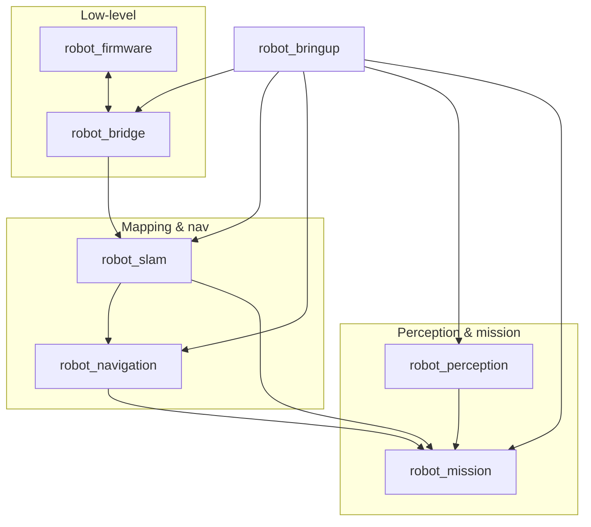

# Packages Index

ROS 2 packages and firmware live under `robot_ws/src/`.

| Package | Build | Entry points / artifacts |
| --- | --- | --- |
| [robot_bringup](robot_bringup.md) | ament_cmake | `full_system.launch.py` |
| [robot_firmware](robot_firmware.md) | Arduino | `robot_firmware.ino` |
| [robot_bridge](robot_bridge.md) | ament_python | `serial_bridge_node` |
| [robot_slam](robot_slam.md) | ament_cmake | `slam.launch.py`, params |
| [robot_navigation](robot_navigation.md) | ament_python | Nav2 params, `frontier_explorer_node` |
| [robot_perception](robot_perception.md) | ament_python | `yolo_detector_node`, usb_cam launch |
| [robot_mission](robot_mission.md) | ament_python | `mission_node` |

