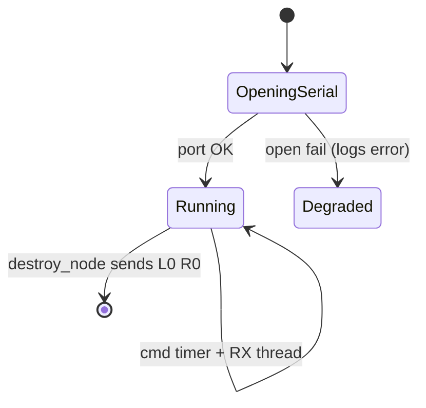

# Package: robot_bridge

## Purpose

Translate between ROS 2 navigation velocities and the Mega’s ASCII PWM protocol, and publish wheel odometry + `odom`→`base_link` TF from encoder tick deltas.

## Location

`robot_ws/src/robot_bridge/`

| Artifact | Role |
| --- | --- |
| `robot_bridge/serial_bridge_node.py` | Node implementation |
| `config/odom_calibration.yaml` | Parameters |
| `launch/bridge.launch.py` | Loads YAML |

## Responsibilities

1. Open serial port (default `/dev/ttyACM0`, 115200). 
2. Subscribe `/cmd_vel`; at `cmd_send_hz` (20 Hz) write `Lpwm Rpwm\n`. 
3. Background thread reads lines; parse `ODOM`; mid-point integrate pose. 
4. Publish `/odom` and broadcast TF. 
5. On shutdown, write `L0 R0` and close port.

## Inverse kinematics (cmd → PWM)

```text
v_left = linear.x - angular.z * track_width / 2
v_right = linear.x + angular.z * track_width / 2
pwm = clamp(round(v_wheel / max_wheel_speed_mps * 255), -255, 255)
```

This is the inverse of the firmware’s forward model `v=(vl+vr)/2`, `ω=(vr−vl)/L`.

## Forward odometry (ticks → pose)

```text
meters_per_tick = 2π R / TPR
dist_l/r = delta_ticks * meters_per_tick
dist = 0.5*(dist_l+dist_r)
dθ = (dist_r - dist_l) / L
x += dist * cos(θ + dθ/2)
y += dist * sin(θ + dθ/2)
θ += dθ
```

## Lifecycle



## Error handling

| Condition | Behavior |
| --- | --- |
| pyserial missing | `SystemExit` at import |
| Port open fail | Log error; timers no-op writes |
| Malformed ODOM | Warn; skip update |
| Write exception | Log error |

## Performance

- RX thread + lock around pose/command state. 
- 20 Hz command rate matches firmware expectation and timeout budget (500 ms ≫ 50 ms).

## Security / safety implications

- Anyone who can publish `/cmd_vel` can drive motors - treat the ROS graph as trusted LAN. 
- Bridge does not authenticate serial peers.

## Related

- [API serial section](../api.md) 
- [Configuration](../configuration.md) 
