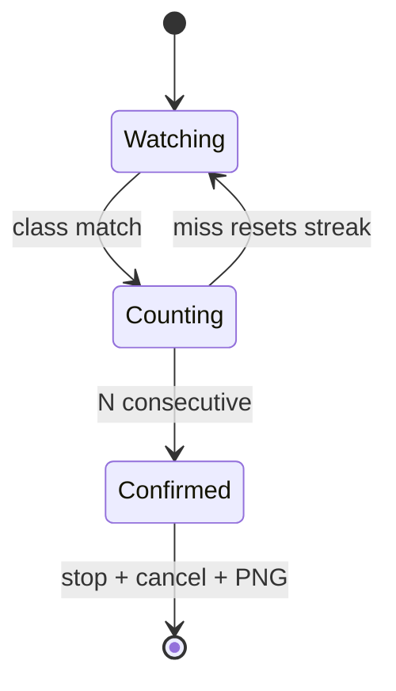

# Package: robot_mission

## Purpose

Fuse vision and mapping: when the configured target class is seen with high confidence for **N consecutive** frames, estimate the target’s **map-frame (x, y)**, stop the robot, cancel Nav2 goals, and save a PNG of `/map` with a red marker.

## Location

`robot_ws/src/robot_mission/robot_mission/mission_node.py`

## Responsibilities

1. Subscribe `/detections`, `/exploration_complete`, `/map`. 
2. Filter by `target_class` + confidence. 
3. Estimate map XY via camera ray (depth optional). 
4. Require `consecutive_required` (default 3) hits. 
5. Lookup `map`→`base_link` (log robot pose). 
6. Publish zero `/cmd_vel`; cancel `navigate_to_pose` goals. 
7. Render occupancy grid to PNG (Pillow); draw red ellipse at target.

## Bearing projection (no depth) - auditable math

Documented in code comments:

1. Pixel `(u,v)` = bbox center. 
2. Optical ray: `x_n=(u-cx)/fx`, `y_n=(v-cy)/fy`, `d_opt ∝ (x_n,y_n,1)`. 
3. Rotate optical → `camera_link` (X forward, Y left, Z up): 
   `x=z_opt`, `y=-x_opt`, `z=-y_opt`. 
4. Intersect ray with plane `z = target_height_m` in **map**, or use `assumed_range_m` if grazing. 
5. Transform point `camera_link` → `map` via TF.

**Example mount (must match bringup/wiring):** 
`base_link`→`camera_link` = (0.12, 0.00, 0.20) m - **validated, ** on the assembled robot.

## Optional depth path

If `use_depth` is true, sample aligned depth around `(u,v)` (16UC1 mm or 32FC1). On failure, fall back to ground-plane method.

## State machine

## Error handling

- TF failures → skip estimate, reset streak. 
- No `/map` at confirm → still stop/cancel; warn and skip PNG. 
- Cancel service missing → rely on zero `/cmd_vel`.

## Limitations

- No-depth localization is approximate (range ambiguity). 
- Does not permanently disable explorer process - cancel + zero cmd; restart explorer if needed. 
- Intrinsics defaults assume ~640×480 webcam - **calibrate**.

## Related

- [Detection workflow](../workflows/detection-mission.md) 
- [API](../api.md) 
