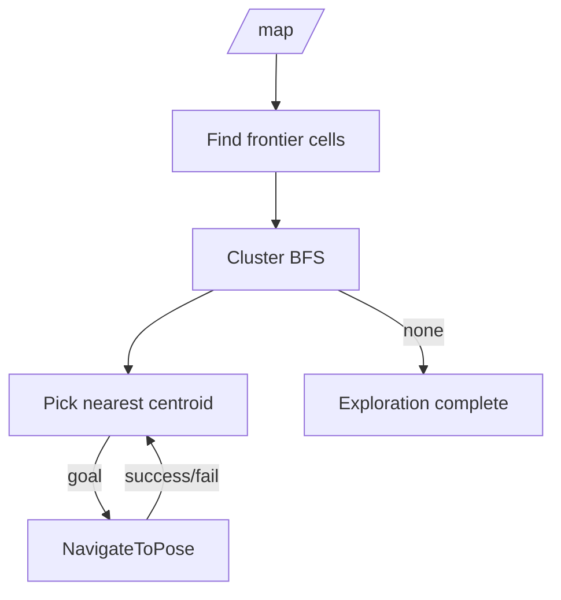

# Package: robot_navigation

## Purpose

Provide Nav2 parameters for a small differential-drive chassis using the live slam_toolbox `/map`, and a **frontier exploration** node that repeatedly sends `NavigateToPose` goals until no frontiers remain.

## Location

`robot_ws/src/robot_navigation/`

| Artifact | Role |
| --- | --- |
| `config/nav2_params.yaml` | Controllers, costmaps, planner |
| `launch/navigation.launch.py` | Includes `nav2_bringup/navigation_launch.py` |
| `robot_navigation/frontier_explorer_node.py` | Explorer |

## Nav2 design choices

| Choice | Rationale |
| --- | --- |
| No AMCL in default bringup | slam_toolbox already publishes `map`→`odom` while mapping |
| Regulated Pure Pursuit | Simpler diff-drive follower than full MPPI for this chassis class |
| Footprint polygon ~0.25×0.20 m | Typical 4WD smart-car size - matched to our chassis |
| `allow_unknown: true` | Frontiers sit on free/unknown boundary |

## Frontier explorer algorithm

1. Subscribe `/map` (transient local). 
2. Mark free cells (`0 ≤ val < 50`) with an 8-neighbor unknown (`-1`) as frontiers. 
3. BFS cluster frontiers (8-connected). 
4. Drop clusters smaller than `min_frontier_size` (default 8). 
5. Skip centroids near blacklisted failed goals. 
6. Pick nearest cluster to robot (`map`→`base_link` TF). 
7. Send `NavigateToPose`; on result, replan. 
8. If no candidates: log `Exploration complete`, publish `/exploration_complete` True.

## Inputs / outputs

| In | Out |
| --- | --- |
| `/map`, TF map→base | `NavigateToPose` goals |
| Nav2 action server | `/exploration_complete` |

## Edge cases

- Blacklist radius prevents infinite retries on unreachable centroids. 
- Does not check global costmap lethality before sending - Nav2 may abort; goal is blacklisted. 
- Large maps: O(width×height) frontier scan each replan period (default 2 s) - acceptable for small indoor maps.

## Related

- [Exploration workflow](../workflows/exploration.md) 
- [nav2_params](../../robot_ws/src/robot_navigation/config/nav2_params.yaml) 
