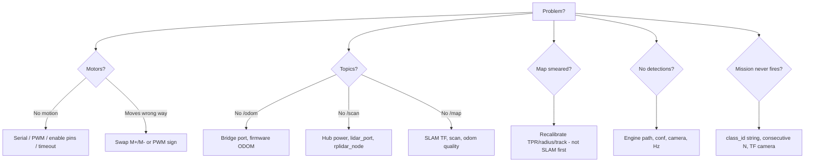

# Troubleshooting

## Quick decision tree



## Symptom catalog

| Symptom | Likely cause | Fix |
| --- | --- | --- |
| `Permission denied` ttyACM | dialout | usermod + relogin |
| Motors run then stop every 0.5 s | No continuous `/cmd_vel` | Teleop/Nav2 not publishing |
| `/scan` intermittent | USB power | Powered hub |
| SLAM drops scans | TF `lidar_link` | static TF + frame_id |
| Nav2 won’t plan | Empty costmap | Wait for `/map`; check static layer |
| Explorer idle | No frontiers / Nav2 down | Expand map; check action server |
| YOLO ImportError | ultralytics/torch | Jetson-compatible install |
| Red dot wrong place | TF/intrinsics/range | Remeasure; calibrate camera |

## Logging tips

```bash
ros2 topic echo /rosout
# Increase node log level:
ros2 run robot_bridge serial_bridge_node --ros-args --log-level debug
```

## Related

- [Build phases](build-phases.md) 
- [Performance](performance.md) 
