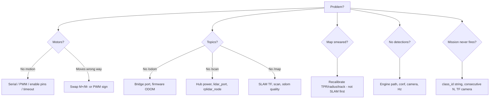

# Troubleshooting

## Quick decision tree

```mermaid
flowchart TD
  A[Problem?] --> B{Motors?}
  B -->|No motion| C[Serial / PWM / enable pins / timeout]
  B -->|Moves wrong way| D[Swap M+/M- or PWM sign]
  A --> E{Topics?}
  E -->|No /odom| F[Bridge port, firmware ODOM]
  E -->|No /scan| G[Hub power, lidar_port, rplidar_node]
  E -->|No /map| H[SLAM TF, scan, odom quality]
  A --> I{Map smeared?}
  I --> J[Recalibrate TPR/radius/track - not SLAM first]
  A --> K{No detections?}
  K --> L[Engine path, conf, camera, Hz]
  A --> M{Mission never fires?}
  M --> N[class_id string, consecutive N, TF camera]
```

## Symptom catalog

