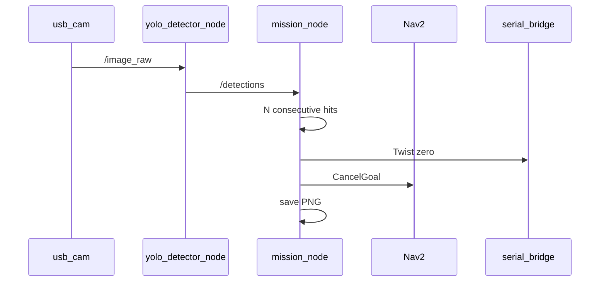

# Workflow: Detection and Mission

From camera frames to a marked map PNG.

## Pipeline

## Operator checklist

1. Engine loaded; `ros2 topic echo /detections` shows the target class string. 
2. `mission_node.target_class` matches that string. 
3. Camera TF and intrinsics set. 
4. Place target in mapped space; allow approach. 
5. Confirm logs: consecutive hits → confirmed pose → PNG path under `mission_outputs/`. 
6. Visually check red dot vs real object location.

## Related

- [robot_mission](../packages/robot_mission.md) 
- [robot_perception](../packages/robot_perception.md) 
- [Verification §4-5](../verification-checklist.md) 
